# **Ranger Med-Core**

### **(Fullstack MERN + ML/AI Healthcare Command Center for Rangers)**

Ranger Med-Core is a full-stack, AI-powered healthcare management system designed to assist Rangers with capsule tracking, symptom logging, dose prediction, and personalized medical insights.
This project integrates **MERN stack**, **AI/ML models**, **push notifications**, and **real-time health dashboards** to deliver a complete medical companion suite.

---

# **Project Overview**

Ranger Med-Core serves as a centralized health command system enabling Rangers to manage capsules, track health patterns, utilize AI-driven health recommendations, and receive dose reminders.
The system includes **multi-role access**, **AI chatbot assistant**, **missed-dose prediction**, **calendar integration**, and a **wellness dashboard**.

---

# **Problem Statement (11)**

**PS Number: *11***

Rangers require a unified health management system to track daily capsules, identify health patterns, predict missed doses, communicate with health professionals, and maintain operational efficiency even in high-pressure situations.
Ranger Med-Core solves this by integrating real-time tracking, AI insights, and predictive modeling into a secure, user-friendly platform.

---

# **Features Implemented**

## **Basic Functionalities**

* **Power Capsule Management**
  Add capsules, set dosage/frequency, track taken/missed capsules with full history.
* **Dose Reminder Engine**
  Automated alerts, snooze options, and high-priority push notifications.
* **Health Dashboard**
  View today’s routine, adherence score, missed streaks, symptom trends, and wellness score.
* **AI Chatbot Health Assistant**
  Provides medicine explanations, symptom guidance, and health suggestions.
* **Symptom Checker**
  Record symptoms, predict possible conditions, assign urgency levels.
* **Role-Based Access** (`Ranger`, `Doctor`, `Health Admin`)
* **Calendar Integration** (doses + appointments)

## **Advanced Functionalities**

* **Missed Dose Prediction (ML Model)**
  Predicts likelihood of skipped doses based on user patterns.
* **Health Timeline**
  Chronological display of capsules, symptoms, and appointments.
* **AI Health Insights & Summaries**
  Weekly insights, symptom-based risk analysis, lifestyle tips.

## **Brownie Points**

* Automatic capsule explanation generation
* Symptom severity estimation
* Personalized wellness recommendations

---

# **Tech Stack Used**

### **Frontend**

* React.js
* TailwindCSS
* Leaflet + OpenStreetMap
* Axios
* Redux Toolkit

### **Backend**

* Node.js
* Express.js
* MongoDB + Mongoose
* JWT Authentication
* FCM Notifications
* Gemini API

---

# **System Architecture / High-Level Design**

### **1. Client (React)**

* Manages UI, state, component workflows
* Communicates with backend through REST APIs
* Integrates maps, charts, AI chat interface

### **2. Backend (Node.js + Express)**

* Handles API routing, authentication, role-based access
* Manages capsule schedules, symptoms, AI calls
* Push notifications + cron scheduler for reminders

### **3. Database (MongoDB)**

* Stores user data, capsules, symptoms, chat logs, roles
* Optimized schema for prediction tasks

### **4. AI/ML Layer**

* OpenAI for chatbot + insights
* Custom logic for Weekly Insights

### **5. Notification Layer**

* FCM for push notifications

---

# **API Documentation (Short Overview)**

Full API documentation is in:
`/docs/API-SPECIFICATION.md`

---

# **Setup Instructions**

## 1️⃣ **Clone the Repository**

```sh
git clone https://github.com/<your-org>/ranger-med-core.git
cd ranger-med-core
```

---

## 2️⃣ **Backend Setup**

```sh
cd backend
npm install
cp .env.example .env
npm run dev
```

Backend runs at: **[http://localhost:5000](http://localhost:5000)**

---

## 3️⃣ **Frontend Setup**

```sh
cd frontend
npm install
cp .env.example .env
npm run dev
```

Frontend runs at: **[http://localhost:3000](http://localhost:3000)**

---

# Deployment Link

**Live Deployment:**
*[https://ranger-med-core.netlify.app]*

---

# **Screenshots / GIFs**

Add all UI screenshots located in:

```
/docs/ui/
```

### Ranger - Dashboard

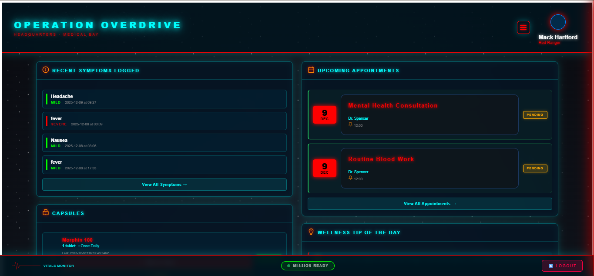

### Doctor - Dashboard

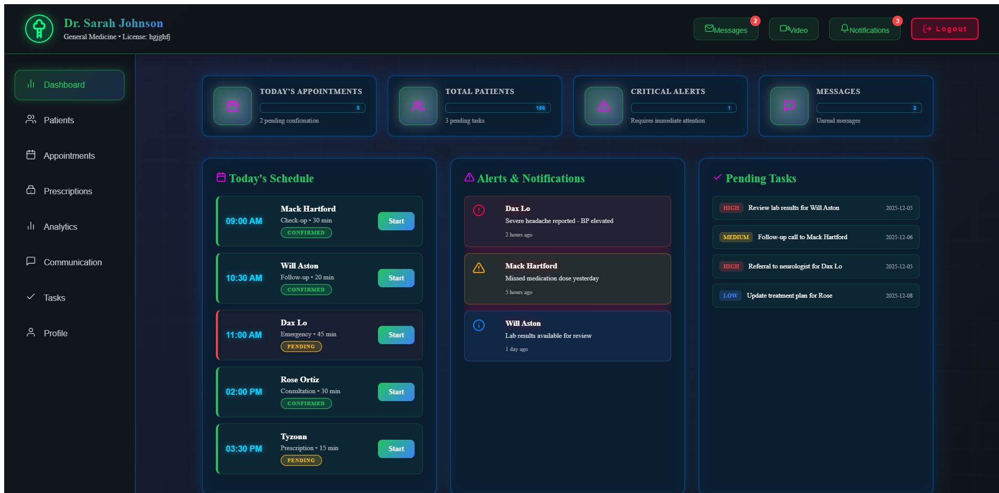

### Zordan - Dashboard

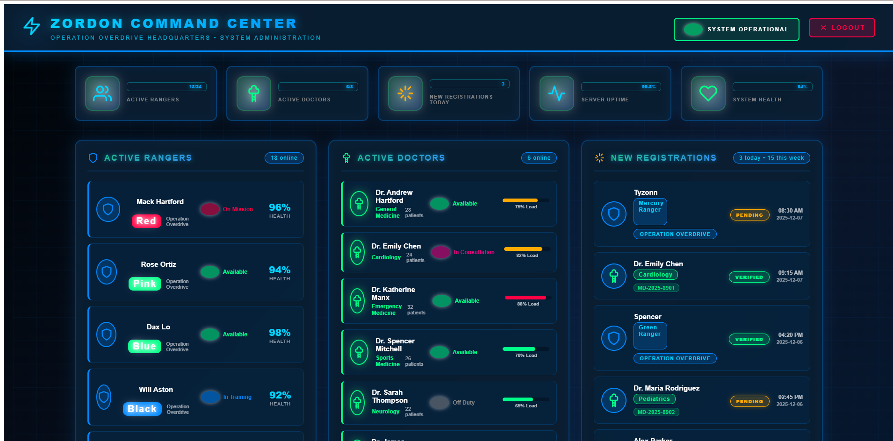

### Capsule Management

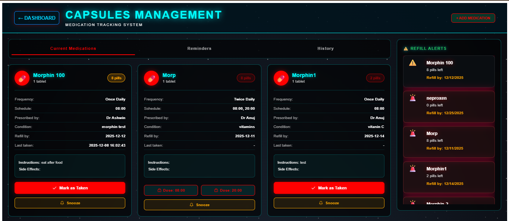

### Symptom Management

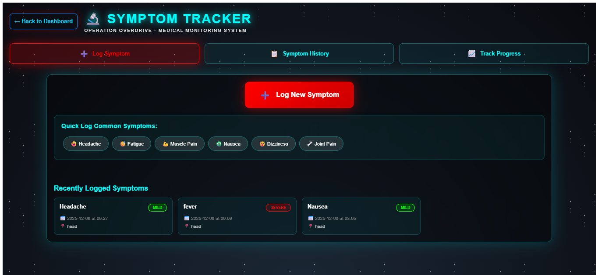

### Symptom Checker

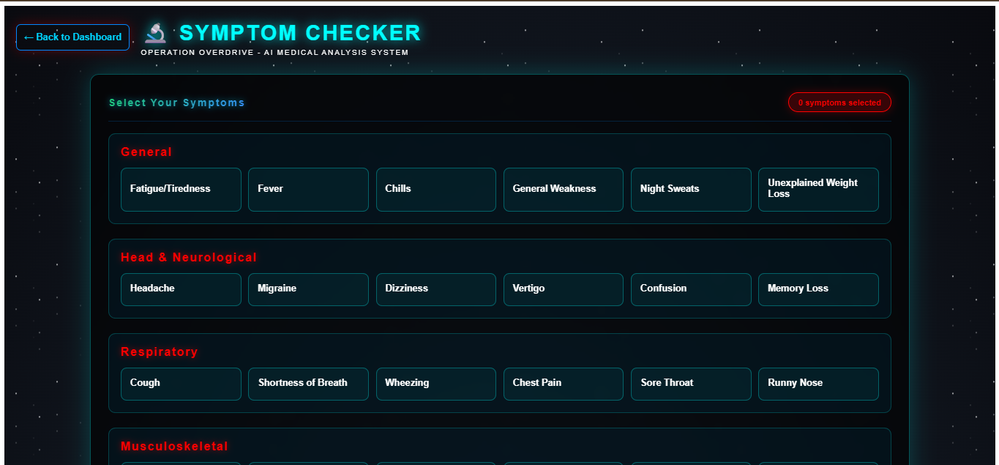

### Appointment

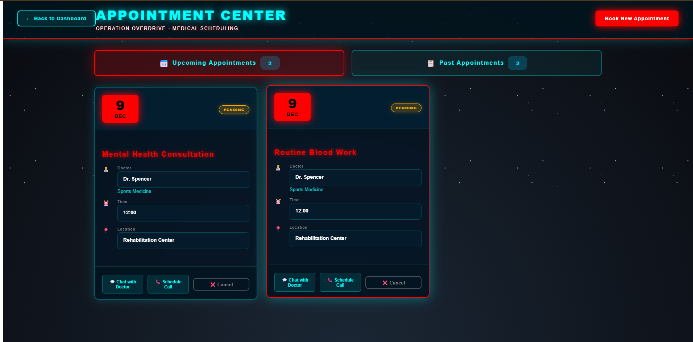


### Ranger Bot AI

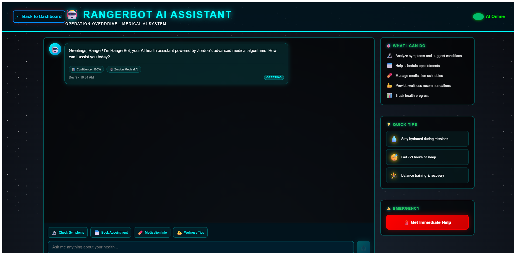

### Timeine

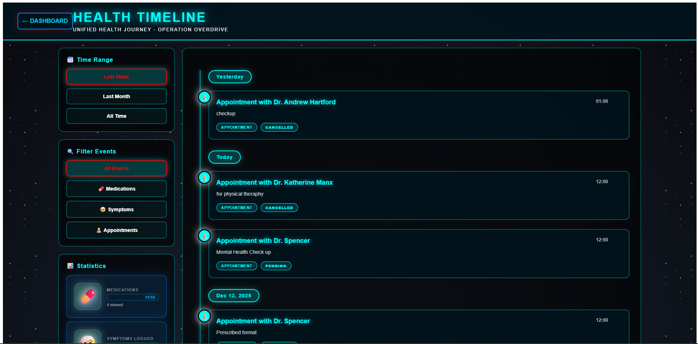

### Weekly Insights

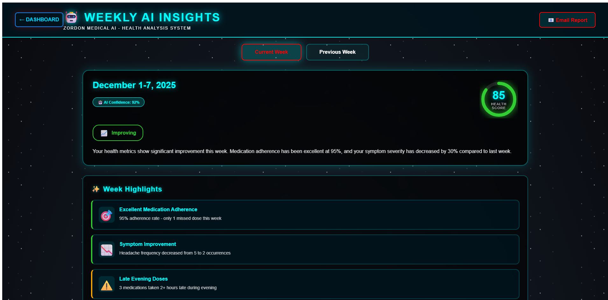

### Ranger Profile

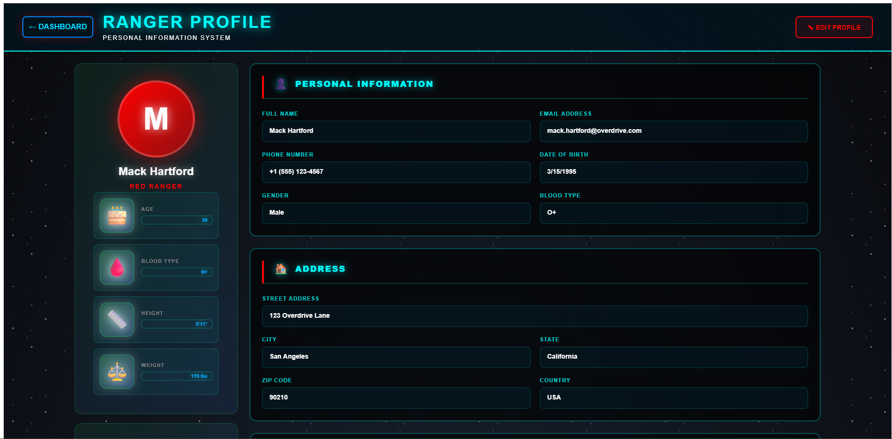
---

# **Error Handling & Reliability Considerations**

* Centralized error middleware (Express)
* MongoDB validation + schema constraints
* Token refresh & expiry handling
* Graceful backend shutdown

---

#  **Team Members and Responsibilities**

| Name                  | Role                    | Contributions                                                                                      |
| --------------------- | ----------------------- | -------------------------------------------------------------------------------------------------- |
| **Himanshu Thakur**   | Full Stack + AI/ML Lead | Designed backend architecture, built Node.js APIs, MongoDB schemas, authentication, AI/ML integration, reminder engine, dose prediction model, and managed overall system logic. |
| **Yashwardhan Singh** | Frontend Lead            | Developed major UI components, implemented capsule management UI, calendar integration, and frontend state management.                                           |
| **Yusra Mirza**       | Frontend Lead           | Worked on UI/UX design, dashboard screens for ranger and doctor, symptoms mangament UI, health visualizations, and onnected APIs on the frontend           |

---

# **Future Improvements**

* Offline mode with local DB sync
* Doctor-to-Ranger live chat
* Improved ML model using deep learning
* Real-time vitals monitoring
* Voice-based AI assistant
* Emergency SOS module
* Medical report PDF generator

---